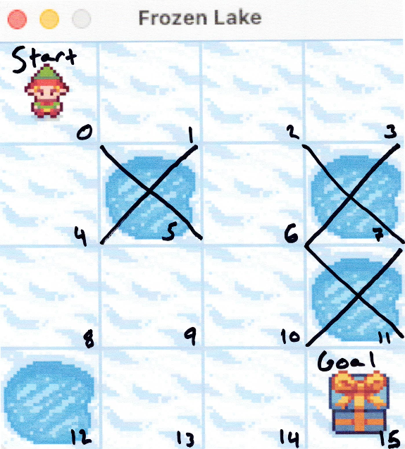
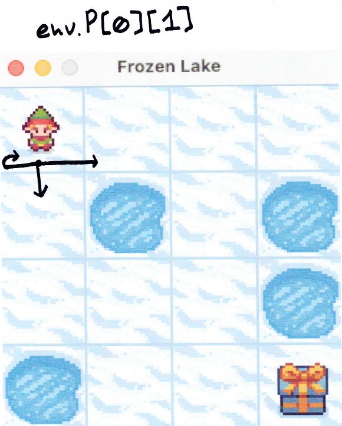

# CSPB-30202-Final-Project

- ****Overview****  
> For this project I chose to use the Frozen Lake environment in OpenAI Gym. 
The goal of my project is to transfer over the iterative evaluation we used 
in previous homework projects and make it work in this environment. 

- ****Approach****  
> The environment consists of a 4x4 grid with 4 different fields consisting of a start, ice, hole and goal field. The hole and goal fields are both terminal states with the former rendering no rewards and the latter returning a reward of 1. The goal is to get the human from the start state to the goal state without falling into a hole. 

> The default transition probabilities are moving in the desired direction, left of that direction or right of that direction, all having ⅓ probability of each action occurring. 

>For testing purposes I’ve created a random policy that picks an action at random and moves throughout the grid, resetting each time the player falls in a hole and exiting the while loop if the goal state is achieved. Following this I’ve implemented an RL algorithm and updated the policy.

- ****Result****  
> See result in video: 
> https://www.youtube.com/watch?v=a-ueXUpM3kk
> https://github.com/spencer2435/CSPB-30202-Final-Project

   
